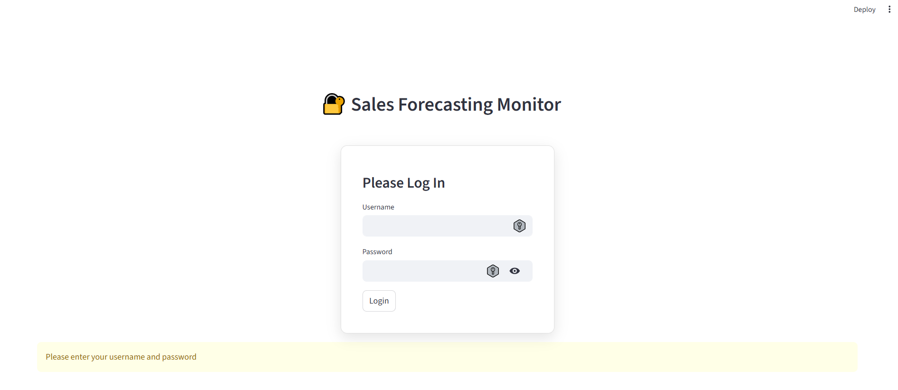
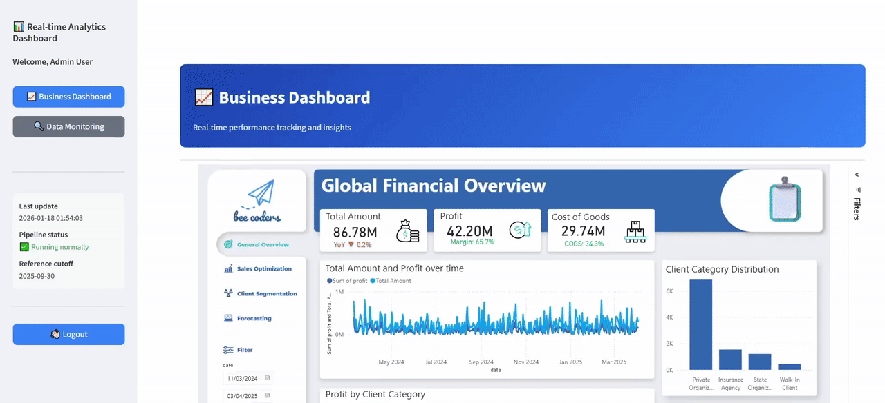
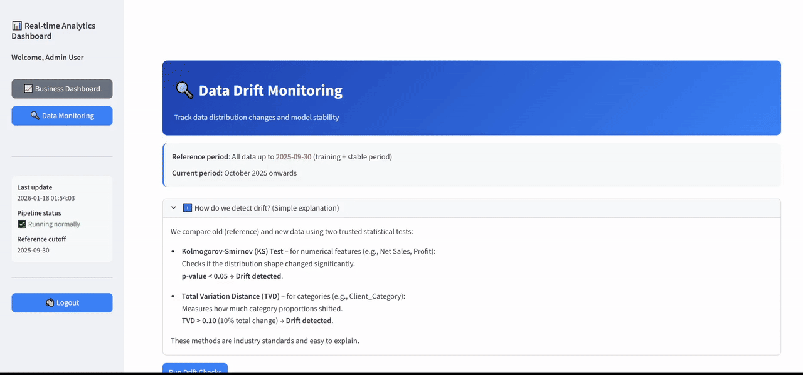
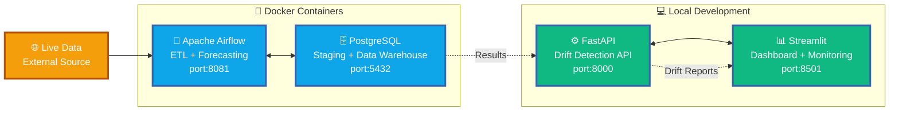
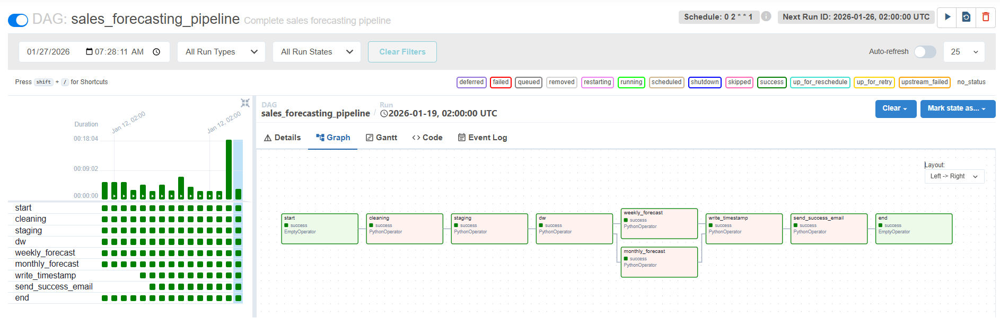
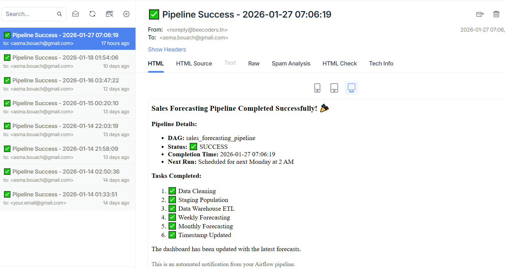

# End-to-End Sales Forecasting & Financial Analytics Platform
**Version 1.1** (Synthetic data recreation, with Streamlit, 2026)  
**Original v1.0** (Internship with real dataset & Symfony web app, 2025)

> **Final Year Engineering Internship Project (Business Intelligence & Data Science)**  
*FR: Conception et mise en place de tableaux de bord décisionnels (BI) intégrant des modèles prédictifs pour optimiser la performance financière et la croissance du chiffre d’affaires (CA).*

An end-to-end sales forecasting and analytics system combining Business Intelligence dashboards, predictive modeling, automated orchestration, and data drift monitoring to optimize financial performance, improve revenue growth, and enable data-driven decision-making through integrated dashboards and predictive models.

---

## 🏗️ Pipeline Workflow

| 📂 Data | ➡️ | 🧹 Preprocessing | ➡️ | 🗄️ Storage & DW | ➡️ | 🤖 Modeling | ➡️ | 🔄 Orchestration| ➡️ | ⚙️ API Serving | ➡️ | 📊 Dashboard |
|----------|------|----------------|------|-------------|------|------------------|------|-------------|------|---------------|------|---------------|
| Excel data | ➡️ | Cleaning, feature engineering, visualization | ➡️ | PostgreSQL (Docker) | ➡️ | XGBoost, ElasticNet, Prophet | ➡️ | Apache Airflow (Docker) | ➡️ | FastAPI | ➡️ |  PowerBI+ Streamlit app |

---

## 🎯 Project Overview

- **Problem**: Manual Excel reporting delays financial decisions, lacks forecasting, overwhelms non-technical staff with growing data volumes.
- **Main Objective**  
Design and implement a decision-support system with interactive dashboards and predictive models to optimize financial performance, revenue growth, and strategic planning.
- **Key Deliverables**  
  - Centralized data warehouse for historical and real-time financial data  
  - Automated ETL pipeline with data quality checks and logging
  - Predictive models for client classification and short-/medium-term forecasting
  - User-friendly PowerBI dashboards for profitability analysis, financial KPI, and customer segmentation  
  - Monitoring layer for data drift and model reliability

## 💻 Application Interfaces

<details>
<summary>Live Look & Feel (click to view)</summary>

**🔐 Authentication**: Secure Streamlit login for controlled access 


**📊 Dashboard**: Power BI dashboards with financial KPIs and trends


**🔍 Data Monitoring**: Drift detection results for the models 


</details>

---

## 🧱 Deployment Architecture



---

## 📊 Key Results & Impact

### Predictive Model Performance

Best-performing models (classification and forecasting tasks)

| Task | Best Model | Key Metrics 
|--------|-----------|-----------|
| Client Category Classification | XGBoost | F1-macro: 0.63 (threshold-tuned), Recall: [0.30, 0.79, 0.83, 0.81] | 
| Weekly Sales Forecasting | ElasticNet | RMSE: 277,987, MAE: 230,609, MAPE: 16.5% | 
| Monthly Sales Forecasting | Prophet | MAPE: 15.8%, MAE: 975,033, RMSE: 1,079,739 | 

> **Note**: Full experimental details, hyperparameter tuning, and analysis available in Jupyter notebooks → [`notebook/`](./notebook)

### System Capabilities
- **End-to-end pipeline**: Raw data → dashboard in automated workflow
- **Explainability**: SHAP-based feature importance for model interpretability
- **Monitoring**: Data drift detection with KS tests and TVD metrics
- **Orchestration**: Apache Airflow with email notifications on success

<details>
<summary>🔄 Pipeline Execution Proof</summary>

**Airflow DAG Graph**  
Complete automated workflow from data ingestion to email notification  


**Success Email Notification**  
Automated alert sent to data team upon pipeline completion  


</details>

### Business Impact (highlighted in Dashboard)
- ⏱️ **Time saved**: Reduced manual reporting from hours to minutes  
- 📈 **Better decisions**: Real-time visibility into profitability and trends  
- 💰 **Revenue growth potential**: Improved client segmentation and resource allocation

**Primary Users**:
- Management & decision-makers → PowerBI dashboards  
- Data & analytics teams → PowerBI dashboards + data monitoring

---

## 🛠️ Tech Stack

**Data & ML**: pandas, scikit-learn, XGBoost, Prophet, Mlflow, Optuna  
**Infrastructure**: PostgreSQL, Apache Airflow, Docker  
**Visualization**: PowerBI, Streamlit  
**Development**: Python 3.10, FastAPI, Pytest

---

## 📦 Getting Started
### Prerequisites
- Docker desktop (with WSL2 backend recommended)
- Python 3.10+
### Installation & First Run
1. **Create and activate virtual environment**:
   - Create and activate a virtual environment:
     ```bash
     py -3.10 -m venv .venv
     .venv\Scripts\activate
     ```
   - Upgrade pip and setuptools:
     ```bash
     python -m pip install --upgrade pip setuptools
     ```
   - Install dependencies:
     ```bash
     pip install --default-timeout=1000 -r requirements.txt
     ```

2. **Docker Services (One-time Setup)**:
   - Build and start all services:
     ```bash
     docker compose build --no-cache
     .\init-db.ps1
     ```

   - Docker run:
     ```bash
     docker compose up -d
     ```
   - Create Airflow admin user (only once):
     ```bash
     docker compose exec airflow-webserver bash

        airflow users create \
        --username airflow \
        --firstname Admin \
        --lastname User \
        --role Admin \
        --email admin@example.com \
        --password airflow

        exit
     ```

### Quick Start
   - Start Docker services:
     ```bash
     docker compose up -d
     docker compose ps  # Check all services healthy
     ```
   - Run Streamlit:
     ```bash
     streamlit run app.py
     ```
   - Run FastAPI:
     ```bash
     uvicorn src.api.api:app --reload --port=8000
     ```

### Access Services
- Streamlit: [http://localhost:8501](http://localhost:8501)
- Airflow UI: [http://localhost:8081](http://localhost:8081) (user: airflow / pass: airflow)
- FastAPI: [http://localhost:8000/docs](http://localhost:8000/docs) 

### Run the Pipeline

- Trigger the DAG manually in Airflow UI: `sales_forecasting_pipeline`
- Or wait for scheduled run (every Monday 2 AM)
---

## 🧪 Testing

Run unit tests:
```bash
pytest tests/ -v
```
---

## ⚠️ Project Limitations & Future Work

**Limitations**:
- Limited historical data reduced forecast accuracy
- Basic client/transaction features constrained modeling  
- Timeframe limited advanced technique exploration

**Future Work**:
- **Short-term**: Improve raw data entry (column splitting), and integrate additional data sources
- **Medium-term**: Extend the system to HR and Marketing modules (employee payments, more financial details)
- **Long-term**: Migrate to cloud infrastructure for enhanced scalability and team collaboration

## 📎 Data Attribution
This project uses **synthetic financial data** generated for demonstration purposes .\
No confidential or real client information is included.

## 📄 Technical Report

A comparative study of machine learning models for multi-class client classification and sales forecasting in an enterprise decision support setting.

- DOI: https://doi.org/10.5281/zenodo.18396485

## 📚 References & Resources

- **Apache Airflow 2.10**: [Official Documentation](https://airflow.apache.org/docs/apache-airflow/2.10.2/)
- **PostgreSQL 16**: [Docker Hub Image](https://hub.docker.com/_/postgres)
- **MLflow**: [Experiment Tracking](https://mlflow.org/docs/latest/index.html)
- **scikit-learn**: [Documentation](https://scikit-learn.org/stable/)
- **XGBoost**: [Documentation](https://xgboost.readthedocs.io/)
- **Facebook Prophet**: [Official Site](https://facebook.github.io/prophet/)
- **Optuna**: [Hyperparameter Optimization](https://optuna.org/)
- **PowerBI**: [Desktop & DW Integration](https://powerbi.microsoft.com/desktop/)
- **FastAPI**: [Official Documentation](https://fastapi.tiangolo.com/)
- **Streamlit**: [Documentation](https://docs.streamlit.io/)
- **Docker Compose**: [Official Guide](https://docs.docker.com/compose/)

---

## 🙏 Acknowledgments

- **Academic Supervisor**: Dr. **Sahbi Zahaf** for valuable guidance and feedback
- **Professional Mentor**: Mr. **Ahmed Neffeti** for real-world insights and industry mentorship
- **International University of Tunis (UIT)**  for the academic environment and support 
- **BeeCoders Team** for providing the professional environment and resources
- **Open Source Community** for the incredible tools that made this project possible

## 📜 License

- **Code**: MIT License (see [LICENSE](LICENSE))
- **Report**: Creative Commons Attribution 4.0 (CC BY 4.0)

